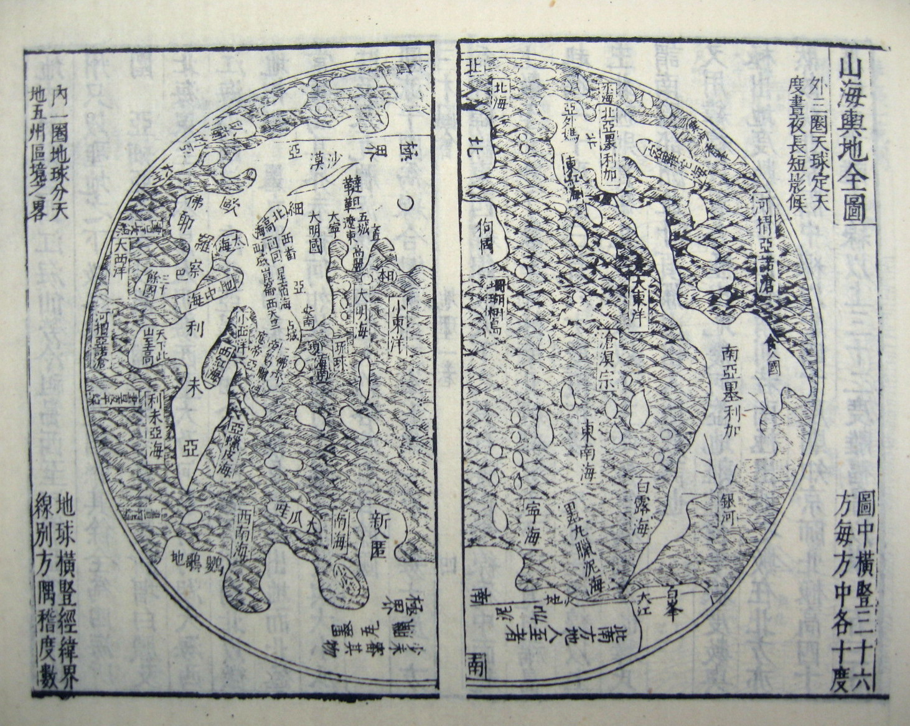

### A few notes on classical Chinese systems of knowledge

In Borges' 1942 essay "The Analytical Language of John Wilkins," he invents a fictional Chinese encyclopedia named the _Celestial Emporium of Benevolent Knowledge_. It proposes a taxonomy of all animals with the following categories:

> …animals are divided into:
> 
> (a) those that belong to the Emperor,
> 
> (b) embalmed ones,
> 
> (c) those that are trained,
> 
> (d) suckling pigs,
> 
> (e) mermaids,
> 
> (f) fabulous ones,
> 
> (g) stray dogs,
> 
> (h) those that are included in this classification,
> 
> (i) those that tremble as if they were mad,
> 
> (j) innumerable ones,
> 
> (k) those drawn with a very fine camel brush,
> 
> (l) others,
> 
> (m) those that have just broken a flower vase,
> 
> (n) those that resemble flies from a distance.

(A brief amusing aside: Borges was a genius at confounding fact with fiction and couching it in the patois of academia. He did such a convincing job in this essay that a number of genuine academics believed that the _Celestial Emporium of Benevolent Knowledge_ existed. So powerful was Borges' spell, that at least one academic wouldn't give up on the book even when he discovered that Borges had made it up. [In an email to the Linguistics Mailing List][1], Professor Laszlo Cseresnyesi (of the department of Linguistics at Shikoku Gakuin University), wrote, ”The responses I have received leave no doubt that I’d better give up on the search for the _Celestial Emporium of Benevolent Creatures_ (and stop pestering my colleagues at the Chinese Department). __However, I believe that one cannot prove the non-existence of a book conclusively__, and I have had no chance to follow all the conceivable leads in a major library.)  

What is this fantastical taxonomy of animals? Borges is parodying a type of Chinese encyclopedia known as a _leishu_.  A _leishu_ is a (typically colossal) Chinese encyclopedia[^1] produced between the 2nd and 18th centuries which (typically) attempted to capture the entire realm of extant knowledge. The most ambitious was the _[Yongle Dadian][2]_: 11,095 volumes comprising 370m Chinese ideograms. It took a team of 2,169 scholars four years to compile (poor sub-subs!). By the time it was complete (1408), the Ming treasury was empty and so it was never printed. Only 3.5% of it remains, the rest having been lost to fires, civil unrest, looting and various vicissitudes of history.

More interesting than their scale are their attempts at ordering all knowledge into logical, hierarchical systems. Basically, the table of contents. For example, take the _Erh Ya_ - the oldest surviving Chinese _leishu_. The title is elusive in a Tao-ish way, but one translation is "Progress Towards Correctness". It arranged its materials into nineteen chapters:

1. Old Words
2. Words
3. Instructions
4. Relatives
5. Dwellings
6. Utensils
7. Music
8. Heaven
9. Earth
10. Hills
11. Mountains
12. Rivers
13. Plants
14. Trees
15. Insects
16. Fishes
17. Birds
18. Beasts
19. Domestic Animals

There are wonderful, head-scratching things here. There are separate categories for "hills" and "mountains." There are categories for "Old Words," "Words" and "Instructions." Borges, who had a knack for cognitive dissonance of the philosophical variety, must have immediately sniffed epistemological  blood in the water. He cleverly incorporated self-referential categories ("those that are included in this classification") and categories that are hilariously over-specific ("those that have just broken a flower vase").

Here's one more example of a real _leishu_: the _[Gujin Tushu Jicheng][3]_ or “Complete Collection of Illustrations and Writings from the Earliest to Current Times” had 6 divisions containing 32 subdivisions:

1.  Heavens/Time/Calendrics: Celestial objects, the seasons, calendar mathematics and astronomy, heavenly portents

2.  Earth/Geography: Mineralogy, political geography, list of rivers and mountains, other nations (Korea, Japan, India, Kingdom of Khotan, Ryukyu Kingdom)

3.  Man/Society: Imperial attributes and annals, the imperial household, biographies of mandarins, kinship and relations, social intercourse, dictionary of surnames, human relations, biographies of women

4.  Nature: Proclivities (crafts, divination, games, medicine), spirits and unearthly beings, fauna, flora

5.  Philosophy: Classics of non-fiction, aspects of philosophy (numerology, filial piety, shame, etc.), forms of writing, philology and literary studies

6.  Economy: education and imperial examination, maintenance of the civil service, food and commerce, etiquette and ceremony, music, the military system, the judicial system, styles of craft and architecture

The only task left is to invent our own _leishu_ taxonomy of knowledge. To really push the idea to a breaking point, I thought it would be fun to create a taxonomy of taxonomies of knowledge, eg. a meta-\_leishu\_:

* Those systems that are complete and logically infallible
* Those systems that include themselves
* Those systems that only include _real_ things and exclude mythological or fictional entities
* Those systems that are scientifically provable and do not require faith or any illogical belief
* Those systems that are taught in schools
* Those systems that are crowd-sourced
* Those systems that are accessible to blind or deaf people
* Those systems that anticipate Confucius
* Those systems that Ludwig Wittgenstein was unaware of\*
* Those systems that can be translated into any language

[^1:] 'Encyclopedia' isn't exactly the correct word. There isn't a correct word in English. A _leishu_ is a mixture of dictionary, thesaurus, and encyclopaedia. It's perhaps closer to an _anthology_ since they would incorporate many long (or total) excerpts from other printed works.

---- 

![leishu][image-1]

Names of leishu

• Expanded Records of a Forest of Matters (Shilin guangji)

• Complete Collection of Classified Affairs Essential for Those Living at Home (Jujia biyong shilei quanji)

• Collectanea of Works Inquiring into and Extending Knowledge (Gezhi congshu)

-- haiku about amsterdam

-- napoleon cheating

[1]:	http://www.linguistlist.org/issues/7/7-1446.html
[2]:	http://www.wdl.org/en/item/3019/
[3]:	https://en.wikipedia.org/wiki/Gujin_Tushu_Jicheng

[image-1]:	./leishu.jpg